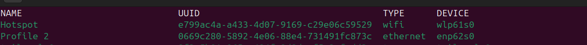

# The Problem

Omarchy doesnt have a native button/toggle-button to turn mobile hotspot on . 

# The fix ( workaround)

While an absoulute fix might be to create a toggle button , and contribute it. But for now
a workaround fix  I did is : 

## Workaround fix 


If you have NMCLI :
### Easier fix

First create a hotspot profile using : 

```bash 
nmcli device wifi hotspot ifname wlan0 ssid MyHotspot password "mypassword123"
```

Then make the connection available : 

```bash
sudo connection up Hotspot 
```

This 
If that works, cheers ! ( did not work for me tho)

### Absolute fix

Check if your firewall is blocking the incoming request from your mobile device
(if ufw is dropping the DHCP request from phone, even before reaching to the dnsmasq )


```bash 
sudo ufw status verbose 
```

If it says something like : 

Status: active
Logging: on (low)
Default: deny (incoming), allow (outgoing), disabled (routed)
New profiles: skip

Now you need to allow the traffic(request )from your phone on the hotspot interface.

<h1>You need to first know your device name </h1> 

```bash 
nmcli connection show
```
Then look for under the device name 



the output shows your network adapters, with device name "wlp61s0" under wifi- with ethernet profile "enp62s0" or something else, that is your wifi adapter, and ethernet adapter respectively, which you need to use below . 


```bash
# Allow all traffic on the hotspot interface (DHCP, DNS, etc. from your phone)
sudo ufw allow in on wlp61s0

# Allow forwarding traffic between the hotspot subnet and your real internet interface
# (swap enp63s0 for whichever interface actually has your internet — check `ip route` if unsure)
sudo ufw route allow in on wlp61s0 out on enp62s0

# Make sure routed forwarding isn't outright rejected as a default policy
sudo ufw default allow routed
sudo ufw reload
```


